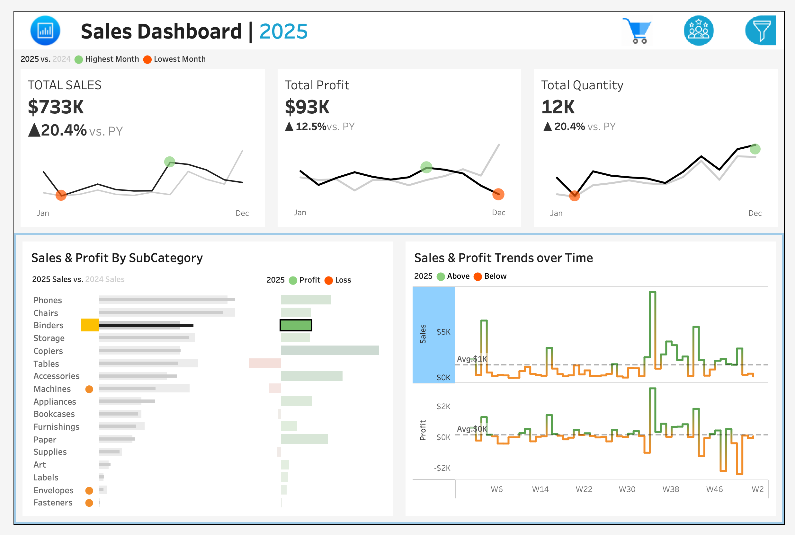
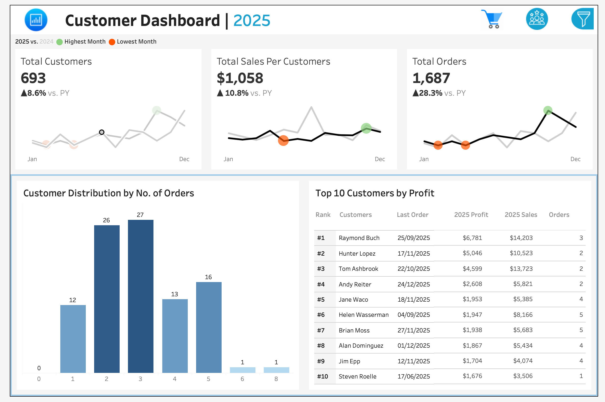

# 📊 Tableau Sales & Customer Performance Dashboard

This project presents interactive Tableau dashboards for analyzing sales performance and customer behavior.

## 🔍 Project Overview

The project contains two dashboards:

### 📈 Sales Dashboard

✅ Total Sales, Profit, and Quantity KPIs

✅ Monthly Sales Trends

✅ Product Subcategory Analysis

✅ Weekly Sales & Profit Trends

---

### 👥 Customer Dashboard

✅ Total Customers

✅ Total Orders

✅ Sales per Customer

✅ Customer Distribution by Orders

✅ Top 10 Customers by Profit

---

## 📸 Dashboard Preview

### Sales Dashboard

### Customer Dashboard

---

## 📂 Files

- `Sales & Customer Dashboards by sid.twbx`
- `README.md`
- `images/`

---

## 🚀 How to Use

1. Download the `.twbx` file.
2. Open it in Tableau Desktop.
3. Explore both dashboards.

---

## 📌 Technologies Used

- Tableau
- Data Visualization
- Calculated Fields
- Interactive Dashboards
- Business Intelligence

---

## 📞 Contact

📧 siddharthkrgupta00007@gmail.com

🔗 LinkedIn:
https://www.linkedin.com/in/siddharth-kumar-gupta-869247289/